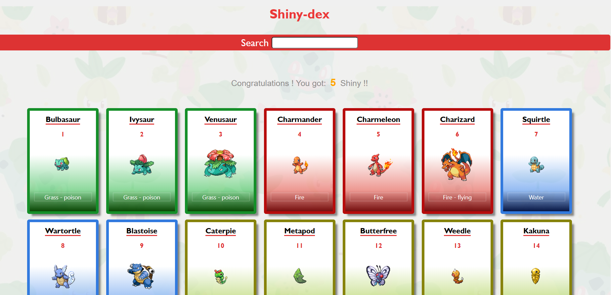
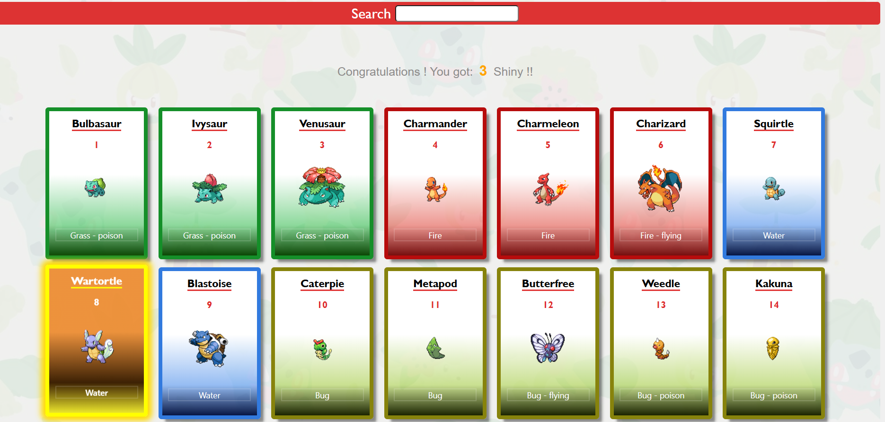

# 🌟 Pokémon Card Explorer 🌟

A dynamic web application that leverages the **PokeAPI** to fetch, display, and manage Pokémon data in an appealing card format. Catch a glimpse of your favorite Pokémon, filter the collection, and try your luck at finding a rare **Shiny** version!

## ✨ Features

* **Extensive Collection:** Fetches and displays Pokémon from **ID 1 to 251** (Generation I and II) using the PokeAPI.
* **Detailed Card View:** Each Pokémon is rendered in a stylish card showing its **ID, Name, Image, and Type(s)**.
* **Random Shiny Chance:** Each time the cards are loaded, there's a **1/77 chance** for any given Pokémon to appear in its rare **Shiny** form.
* **Live Filtering:** Easily find any Pokémon by typing its name into the search bar, with results updating instantly.
* **Responsive Design:** Optimized for a smooth experience across different devices.

## 💻 Technology Stack

* **HTML5**
* **CSS3** (for card styling and basic layout)
* **JavaScript (ES6+)** (for API fetching, data manipulation, and DOM rendering)
* **PokeAPI:** The source for all Pokémon data.

## 🚀 Getting Started

Follow these steps to get a copy of the project up and running on your local machine.

### Prerequisites

You only need a modern web browser to run the application, as all logic is handled client-side in JavaScript.

### Installation

1.  **Clone the repository:**
    ```bash
    git clone [YOUR_REPO_URL]
    ```
2.  **Navigate to the project directory:**
    ```bash
    cd pokemon-card-explorer
    ```
3.  **Open `index.html`** in your favorite web browser.

## 📸 Application Preview

Take a look at the application in action.

### 1. Main Card View

The main interface displays the fetched Pokémon cards. Notice the clean layout and the dedicated search bar at the top.



### 2. Live Filtering in Action

As you type into the search bar, the card collection updates dynamically, making it easy to zero in on specific Pokémon. The user settings section (where the image originally pointed) is replaced by the actual feature of this app: **The Shiny Counter and Search input**.



## 💡 How it Works (Code Snippets)

### Fetching Pokémon Data

The core data is asynchronously retrieved from the PokeAPI.

```javascript
// Fetches Pokémon from base ID up to the limit
const getPokemons = async (base = 1, limit = 9) => {
    // ... loader management ...
    for (base; base <= limit; base++) {
        const response = await fetch(`https://pokeapi.co/api/v2/pokemon/${base}`)
        const data = await response.json()
        packPokemon.push(data)
    }
    // ...
}